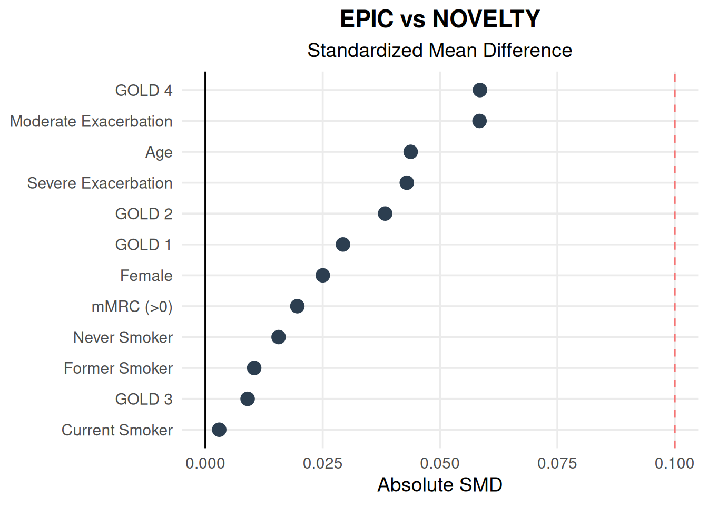

------------------------------------------------------------------------

## 1. Process EPIC Simulation Data

The EPIC simulation (`epic_selected`) outputted from the Copula model are standardized into numeric formats (0/1 for binary and categorical, continuous for others) to facilitate statistical comparison."


::: {.cell}

```{.r .cell-code}
# ==============================================================================
#  DATA PREPARATION FOR ANALYSIS
# ==============================================================================
#   - Load the final cohort of simulated patients selected by the Copula model.
#   - Standardize the data to calculate the Standardized Mean Difference (SMD).
#   - Transform categorical variables and binary variables to 0 or 1 values.
#
# 
#   For example to calculate the percentage of a category (like "GOLD 1"), it has to 
#   be first converted into a numeric format where 1 = Yes and 0 = No.
#
#   Example:
#   If we have a group of 10 people where 4 are GOLD 1 (coded as 1) and 6 are 
#   not GOLD 1 (coded as 0), summing the column gives us 4. Calculating the 
#   mean (4 / 10) results in 0.40, which confirms that 40% of the 
#   group are GOLD 1.

# Load simulation data
if (file.exists("epic_selected.rds")) {
  epic_selected <- readRDS("epic_selected.rds")
} else {
  stop("ERROR: Could not find epic_selected.rds")
}

# Transform data 
# Create a clean table ('epic_baseline') of variables for Table 1.
epic_baseline <- epic_selected %>%
  transmute(
    # --- Binary variables (Yes/No) ---
    # Convert gender to a number: 1 = Female, 0 = Male
    Female = case_when(
      grepl("Female", as.character(female), ignore.case = TRUE) ~ 1,
      as.character(female) == "1" ~ 1,
      TRUE ~ 0
    ),
    
    # Convert mMRC to a number: 1 = Yes (Score > 0), 0 = No
    `mMRC (>0)` = case_when(
      grepl("Yes", as.character(dyspnea), ignore.case = TRUE) ~ 1,
      as.character(dyspnea) == "1" ~ 1,
      TRUE ~ 0
    ),
    
    # --- Continuous variables averages ---
    # Ensure these are treated as numbers to calculate mean and SD.
    Age = as.numeric(age_at_COPD),
    `Moderate Exacerbation` = as.numeric(as.character(exac_history_n_moderate)),
    `Severe Exacerbation`   = as.numeric(as.character(exac_history_n_severe_plus)),
    
    # --- Categorical variables  ---
    # First convert it to a simple number (1, 2, 3, 4).
    gold_num = case_when(
      grepl("1", as.character(gold)) ~ 1,
      grepl("2", as.character(gold)) ~ 2,
      grepl("3", as.character(gold)) ~ 3,
      grepl("4", as.character(gold)) ~ 4,
      TRUE ~ NA_real_
    ),
    
    # Same for smoking: Convert "Current", "Former", "Never" into 0, 1, 2.
    smoke_num = case_when(
      grepl("Never", as.character(smoking_status), ignore.case = TRUE) ~ 0,
      grepl("Current", as.character(smoking_status), ignore.case = TRUE) ~ 1,
      grepl("Former", as.character(smoking_status), ignore.case = TRUE) ~ 2,
      as.character(smoking_status) == "0" ~ 0,
      as.character(smoking_status) == "1" ~ 1,
      as.character(smoking_status) == "2" ~ 2,
      TRUE ~ NA_real_
    )
  ) %>%
  
  # Create the binary encoding
  # Here we split the categories into specific Yes/No columns.
  # Example: If a patient is GOLD 1, the 'GOLD 1' column gets a 1, and patients without 'GOLD 1' gets a 0.
  mutate(
    `GOLD 1` = as.integer(gold_num == 1),
    `GOLD 2` = as.integer(gold_num == 2),
    `GOLD 3` = as.integer(gold_num == 3),
    `GOLD 4` = as.integer(gold_num == 4),
    `Never Smoker`   = as.integer(smoke_num == 0),
    `Current Smoker` = as.integer(smoke_num == 1),
    `Former Smoker`  = as.integer(smoke_num == 2)
  )
```
:::


## 2. Generate Table 1 and Determine **Standardized Mean Difference**

Baseline characteristics are presented, reporting the Mean (SD) for continuous variables and counts with percentages for binary and categorical variables. The Standardized Mean Difference (SMD) is calculated to assess balance. For binary and categorical variables, SMDs are calculated by treating the variable as a binary (0/1) indicator, where the standard deviation is derived from the proportion.


::: {.cell}

```{.r .cell-code}
# ==============================================================================
#  STATISTICAL COMPARISON (SMD CALCULATION)
# ==============================================================================

# Define NOVELTY Baseline
novelty_baseline <- tibble::tribble(
  ~Variable,                ~Type,         ~NOV_Mean, ~NOV_SD_Reported,
  "Age",                    "continuous",  65.3,      9.3,
  "Female",                 "binary",      0.403,     NA,
  "GOLD 1",                 "binary",      0.047,     NA,
  "GOLD 2",                 "binary",      0.396,     NA,
  "GOLD 3",                 "binary",      0.398,     NA,
  "GOLD 4",                 "binary",      0.159,     NA,
  "Never Smoker",           "binary",      0.058,     NA,
  "Current Smoker",         "binary",      0.342,     NA,
  "Former Smoker",          "binary",      0.600,     NA,
  "Moderate Exacerbation",  "continuous",  0.28,      0.68,
  "Severe Exacerbation",    "continuous",  0.23,      0.56,
  "mMRC (>0)",              "binary",      0.913,     NA
) %>%
  mutate(
    # Calculate SD for binary variables using sqrt(p * (1-p))
    NOV_SD = if_else(Type == "binary", sqrt(NOV_Mean * (1 - NOV_Mean)), NOV_SD_Reported)
  )

# Calculate EPIC Cohort Stats
epic_stats <- epic_baseline %>%
  summarise(across(everything(), list(
    Mean = ~mean(., na.rm = TRUE),
    SD   = ~sd(., na.rm = TRUE)
  ))) %>%
  pivot_longer(
    cols = everything(), 
    names_to = c("Variable", ".value"), 
    names_pattern = "(.*)_(.*)"
  ) %>%
  rename(EPIC_Mean = Mean, EPIC_SD = SD)

# Join and calculate SMD
epic_novelty_calc<- novelty_baseline %>%
  left_join(epic_stats, by = "Variable") %>%
  mutate(
    # Correct SD for EPIC binary variables
    EPIC_SD = if_else(Type == "binary", sqrt(EPIC_Mean * (1 - EPIC_Mean)), EPIC_SD),
    
    # Calculate Pooled SD
    Pooled_SD = sqrt((EPIC_SD^2 + NOV_SD^2) / 2),
    
    # Calculate SMD
    SMD = if_else(Pooled_SD == 0, 0, abs(EPIC_Mean - NOV_Mean) / Pooled_SD)
  )

# Format to display "🟢 Balanced" and "🔴 Imbalanced"
epic_novelty_baseline<- epic_novelty_calc %>%
  mutate(
    `NOVELTY` = case_when(
      Type == "continuous" ~ sprintf("%.2f (%.2f)", NOV_Mean, NOV_SD),
      Type == "binary"     ~ sprintf("%.2f%%", NOV_Mean * 100)
    ),
    `EPIC` = case_when(
      Type == "continuous" ~ sprintf("%.2f (%.2f)", EPIC_Mean, EPIC_SD),
      Type == "binary"     ~ sprintf("%.2f%%", EPIC_Mean * 100)
    ),
    # --- Traffic Light Logic ---
    Status = if_else(SMD < 0.1, "🟢 Balanced", "🔴 Imbalanced"),
    SMD = sprintf("%.3f", SMD)
  ) %>%
  select(Variable, `NOVELTY`, `EPIC`, SMD, Status)

# Add number of NOVELTY and EPIC patients included for the baseline table
n_epic <- nrow(epic_baseline)      
n_novelty <- "465"               

# Create the "Total" row
total_row <- tibble::tibble(
  Variable  = "Total Number of Patients (N)",
  `NOVELTY` = as.character(n_novelty),
  `EPIC`    = as.character(n_epic),
  SMD       = "",                  # Leave blank (no SMD for sample size)
  Status    = ""                   # Leave blank (no status for sample size)
)

# 3. Attach it to the top of your table
epic_novelty_baseline <- bind_rows(total_row, epic_novelty_baseline)

# Print table
kable(epic_novelty_baseline, caption = "Table 1: Comparison of NOVELTY vs. EPIC Cohort")
```

::: {.cell-output-display}


Table: Table 1: Comparison of NOVELTY vs. EPIC Cohort

|Variable                     |NOVELTY      |EPIC         |SMD   |Status      |
|:----------------------------|:------------|:------------|:-----|:-----------|
|Total Number of Patients (N) |465          |10000        |      |            |
|Age                          |65.30 (9.30) |65.70 (8.77) |0.044 |🟢 Balanced |
|Female                       |40.30%       |41.53%       |0.025 |🟢 Balanced |
|GOLD 1                       |4.70%        |5.34%        |0.029 |🟢 Balanced |
|GOLD 2                       |39.60%       |41.48%       |0.038 |🟢 Balanced |
|GOLD 3                       |39.80%       |39.36%       |0.009 |🟢 Balanced |
|GOLD 4                       |15.90%       |13.82%       |0.059 |🟢 Balanced |
|Never Smoker                 |5.80%        |6.17%        |0.016 |🟢 Balanced |
|Current Smoker               |34.20%       |34.34%       |0.003 |🟢 Balanced |
|Former Smoker                |60.00%       |59.49%       |0.010 |🟢 Balanced |
|Moderate Exacerbation        |0.28 (0.68)  |0.25 (0.47)  |0.058 |🟢 Balanced |
|Severe Exacerbation          |0.23 (0.56)  |0.21 (0.41)  |0.043 |🟢 Balanced |
|mMRC (>0)                    |91.30%       |90.74%       |0.020 |🟢 Balanced |


:::
:::


## 3. Visual Comparison

Below is a visualization of the Standardized Mean Differences (SMD) for the baseline characteristics. The red dashed line at **0.1** represents the SMD threshold representing a balanced comparative cohort.


::: {.cell}

```{.r .cell-code}
plot_data <- epic_novelty_calc

# Generate Plot
ggplot(plot_data, aes(x = SMD, y = reorder(Variable, SMD))) + 
  # Set a single static color here (e.g., "#2c3e50" is a nice dark blue-grey)
  geom_point(size = 4, color = "#2c3e50") + 
  geom_vline(xintercept = 0.1, linetype = "dashed", color = "red", alpha = 0.5) +
  geom_vline(xintercept = 0, color = "black") +
  labs(
    title = "EPIC vs NOVELTY",
    subtitle = "Standardized Mean Difference",
    x = "Absolute SMD",
    y = NULL
  ) +
  theme_minimal(base_size = 14) +
  theme(
    panel.grid.minor = element_blank(),
    plot.title    = element_text(face = "bold", hjust = 0.5),
    plot.subtitle = element_text(hjust = 0.5)
  )
```

::: {.cell-output-display}
{width=672}
:::
:::


## 4. External Validation: Comparing EPIC and NOVELTY Results

This section executes the negative binomial model for the EPIC cohort to estimate exacerbation outcomes. The rate ratios are then compared between the NOVELTY and EPIC cohort.


::: {.cell}

```{.r .cell-code}
# ==============================================================================
# LOAD EPIC DATA 
# ==============================================================================

# 'combined_histories' contains the full lifetime of every patient (creation to death).
#  We cannot only use this dataset because it includes years of history and does not contain the index date 
#  We will also need to use epic_selected which contains the list of patients chosen by the Copula. This was already loaded previously in Step 1.
if (!exists("combined_histories")) {
  if (file.exists("combined_histories.rds")) {
    message("Loading 'combined_histories' from RDS file...")
    combined_histories <- readRDS("combined_histories.rds")
  } else {
    stop("Error: 'combined_histories' is missing.")
  }
}

# ==============================================================================
# LINKING DATASETS FOR THE EPIC SIMULATION
# ==============================================================================

# Look up the selected patients using the 'id' + '.run_id' columns from epic_selected
# The "id" represents the patient 'id' and the '.run_id' represents which EPIC run the patient was in
# Because we run EPIC many times to find the appropriate match of patients,
# looking for the 'id' + '.run_id' combination is to identify each unique patient included in the analysis
index_lookup <- epic_selected %>%
  select(id, .run_id, index_time = local_time) %>%
  mutate(
    id = as.character(id),
    .run_id = as.integer(.run_id)
  )

# Prepare the combined_histories dataset to join with epic_selected
history_EPIC <- combined_histories %>%
  # Ensure variable types match
  mutate(
    id = as.character(id),
    .run_id = as.integer(.run_id),
    local_time = as.numeric(local_time),
    medication_status = suppressWarnings(as.numeric(medication_status)),
    # Ensure event counts are numeric for calculation later
    exac_history_n_moderate = as.numeric(exac_history_n_moderate),
    exac_history_n_severe_plus = as.numeric(exac_history_n_severe_plus)
  ) %>%
  
  # We link the history file to the lookup dataset using 'id' and the '.run_id'
  # This adds the column 'index_time' to every row of the patient's history.
  inner_join(index_lookup, by = c("id", ".run_id")) %>%
  
  # We delete all rows where 'local_time' is less than 'index_time'.
  # This removes the Pre-Index History so we don't analyze it.
  filter(local_time >= index_time) %>%
  
  # Create a unique ID for grouping and sort chronologically
  mutate(unique_id = paste0(id, "_run", .run_id)) %>%
  arrange(unique_id, local_time)

# ==============================================================================
# CALCULATE NUMBER OF EXACERBATION EVENTS FOR EPIC COHORT
# ==============================================================================

exac_data_EPIC <- history_EPIC %>%
  group_by(unique_id) %>%
  mutate(
    # Calculate time elapsed since previous record
    followup_time = c(0, diff(local_time)),
    # Identify the medication the patient was on during that interval.
    # lag() is used because the time spent getting to the current local_time
    # was spent on the medication status recorded in the previous row.
    med_status_start_of_interval = lag(medication_status),
    # Calculate new events occurring at the end of this interval
    events_mod_new = c(0, diff(exac_history_n_moderate)),
    events_sev_new = c(0, diff(exac_history_n_severe_plus))
  ) %>%
  # Remove the baseline row (it has no 'previous' med and 0 exposure)
  filter(followup_time > 0) %>%
  # Override medication_status with the lagged version for the regression
  mutate(medication_status = med_status_start_of_interval) %>%
  ungroup()

# ==============================================================================
#  PREPARE EPIC DATASET FOR MODEL
# ==============================================================================

# Group 0 & 1 together to be the reference (No therapy or SABA only); 
# Group 4= Monotherapy (LAMA/LABA/ICS), Group 6= Dual therapy (LAMA + LABA, ICS + LABA), 14 (ICS + LAMA + LABA)
target_meds <- c("1", "4", "6", "14")

analysis_EPIC_final <- exac_data_EPIC  %>%
  mutate(
    med_group = case_when(
      medication_status %in% c(0, 1) ~ "1",
      medication_status == 4         ~ "4",
      medication_status == 6         ~ "6",
      medication_status == 14        ~ "14",
      TRUE                           ~ NA_character_
    )
  ) %>%
  filter(!is.na(med_group)) %>%
  mutate(med_group = factor(med_group, levels = target_meds)) %>%
  
  # Matches the NOVELTY analysis of splitting patient history into separate yearly
  # intervals (Year 1, 2, 3) rather than summarizing a single lifetime value.
  # Creates separate rows if a patient changes medication mid-year, ensuring follow-up 
  # is assessed using the correct drug.
  group_by(unique_id, med_group) %>%
  summarise(
    events_mod = sum(events_mod_new, na.rm = TRUE), # Sum of new events
    events_sev = sum(events_sev_new, na.rm = TRUE), # Sum of new events
    exposure   = sum(followup_time, na.rm = TRUE),  # Total time exposed
    .groups = "drop"
  ) %>%
  # Removes rows with negligible follow-up duration
  filter(exposure > 0.04)

# ==============================================================================
# MODEL EPIC EXABERATION RATE 
# ==============================================================================

# This matches the methods used in the NOVELTY regression model
message("\nRunning Moderate Exacerbation Model...")
mod_exac_results <- glmmTMB(
  events_mod ~ med_group + offset(log(exposure)) + (1 | unique_id),
  data = analysis_EPIC_final,
  family = nbinom1
)

message("Running Severe Exacerbation Model...")
sev_exac_results <- glmmTMB(
  events_sev ~ med_group + offset(log(exposure)) + (1 | unique_id),
  data = analysis_EPIC_final,
  family = nbinom1 
)

# ==============================================================================
# EPIC RESULTS OUTPUT
# ==============================================================================

# Extract and format Rate Ratios (RR)
format_results <- function(model, label) {
  broom.mixed::tidy(model, effects = "fixed", conf.int = TRUE) %>%
    mutate(
      Rate_Ratio = exp(estimate),   # Convert Log-Odds to Rate Ratio
      RR_Low     = exp(conf.low),
      RR_High    = exp(conf.high),
      group = case_when(
        term == "(Intercept)" ~ "No Therapy (Reference)",
        term == "med_group4"  ~ "Monotherapy",
        term == "med_group6"  ~ "Dual Therapy",
        term == "med_group14" ~ "Triple Therapy",
        TRUE ~ term
      )
    ) %>%
    select(group, Rate_Ratio, RR_Low, RR_High, p_value = p.value) %>%
    mutate(Outcome = label) %>%
    # Rounding for readability
    mutate(across(c(Rate_Ratio, RR_Low, RR_High), \(x) round(x, 3))) %>%
    mutate(p_value = format.pval(p_value, digits = 3, eps = 0.001))
}

results_EPIC <- bind_rows(
  format_results(mod_exac_results, "Moderate Exacerbations"),
  format_results(sev_exac_results , "Severe Exacerbations")
)

# ==============================================================================
# NOVELTY RESULTS 
# ==============================================================================
# Rate of exacerbation in the NOVELTY cohort

novelty_results <- tibble::tribble(
  ~Outcome,                  ~group,                        ~RR,    ~Low,   ~High,
  "Moderate Exacerbations",  "No Therapy (Reference)",      0.087,  0.043,  0.177,
  "Moderate Exacerbations",  "Monotherapy",                 0.529,  0.159,  1.757,
  "Moderate Exacerbations",  "Dual Therapy",                0.538,  0.220,  1.315,
  "Moderate Exacerbations",  "Triple Therapy",              1.212,  0.566,  2.597,
  "Severe Exacerbations",    "No Therapy (Reference)",      0.022,  0.008,  0.065,
  "Severe Exacerbations",    "Monotherapy",                 2.283,  0.638,  8.167,
  "Severe Exacerbations",    "Dual Therapy",                3.108,  1.031,  9.373,
  "Severe Exacerbations",    "Triple Therapy",              5.446,  1.866,  15.898
)

# ==============================================================================
# COMPARING NOVELTY vs. EPIC 
# ==============================================================================

validation_comparison <- novelty_results %>%
  left_join(
    results_EPIC %>% 
      rename(EPIC_RR = Rate_Ratio, EPIC_Low = RR_Low, EPIC_High = RR_High),
    by = c("Outcome", "group")
  ) %>%
  # FIXED: Naming columns to match the select() call below
  mutate(
    `NOVELTY` = sprintf("%.3f (%.3f, %.3f)", RR, Low, High),
    `EPIC`    = sprintf("%.3f (%.3f, %.3f)", EPIC_RR, EPIC_Low, EPIC_High)
  ) %>%
  # modify column names
  select(
    Outcome, 
    `Medication Category` = group, 
    `NOVELTY`, 
    `EPIC`, 
    `p value` = p_value
  )

# Final formatted table comparing rate of exacerbations between NOVELTY and EPIC
kable(validation_comparison, caption = "Table 2: EPIC vs NOVELTY Exacerbation Rate Ratios (95% CI)")
```

::: {.cell-output-display}


Table: Table 2: EPIC vs NOVELTY Exacerbation Rate Ratios (95% CI)

|Outcome                |Medication Category    |NOVELTY               |EPIC                 |p value |
|:----------------------|:----------------------|:---------------------|:--------------------|:-------|
|Moderate Exacerbations |No Therapy (Reference) |0.087 (0.043, 0.177)  |0.175 (0.167, 0.184) |<0.001  |
|Moderate Exacerbations |Monotherapy            |0.529 (0.159, 1.757)  |0.853 (0.796, 0.913) |<0.001  |
|Moderate Exacerbations |Dual Therapy           |0.538 (0.220, 1.315)  |1.296 (1.197, 1.404) |<0.001  |
|Moderate Exacerbations |Triple Therapy         |1.212 (0.566, 2.597)  |1.903 (1.779, 2.036) |<0.001  |
|Severe Exacerbations   |No Therapy (Reference) |0.022 (0.008, 0.065)  |0.039 (0.035, 0.043) |<0.001  |
|Severe Exacerbations   |Monotherapy            |2.283 (0.638, 8.167)  |0.752 (0.664, 0.851) |<0.001  |
|Severe Exacerbations   |Dual Therapy           |3.108 (1.031, 9.373)  |2.156 (1.890, 2.460) |<0.001  |
|Severe Exacerbations   |Triple Therapy         |5.446 (1.866, 15.898) |3.090 (2.767, 3.450) |<0.001  |


:::
:::


## 5: External Validation: Comparing Rate of Exacerbations between EPIC and NOVELTY

This section compares the annual rate (per person per year) of moderate and severe exacerbations between NOVELTY and EPIC.


::: {.cell}

```{.r .cell-code}
# ==============================================================================
# ANNUAL EXACERBATION RATES
# ==============================================================================

# Calculate NOVELTY Annualized Rates with 95% CI
novelty_rates <- novelty_results %>%
  group_by(Outcome) %>%
  mutate(
    # The Intercept (or "No Therapy") is the baseline rate. 
    Baseline_Rate = RR[group == "No Therapy (Reference)"],
    Baseline_Low  = Low[group == "No Therapy (Reference)"],
    Baseline_High = High[group == "No Therapy (Reference)"],
    
    # Predicted rate of exacerbations of different medication groups = Baseline * Rate Ratio 
    Annual_Rate = if_else(group == "No Therapy (Reference)", Baseline_Rate, Baseline_Rate *    RR),
    Annual_Low  = if_else(group == "No Therapy (Reference)", Baseline_Low, Baseline_Low * Low   ),
    Annual_High = if_else(group == "No Therapy (Reference)", Baseline_High, Baseline_High *    High)
  ) %>%
  # Format for Table 3 presentation
  mutate(NOV_Annual_Rate = sprintf("%.3f (%.3f, %.3f)", Annual_Rate, Annual_Low, Annual_High)) %>%
  select(Outcome, group, NOV_Annual_Rate)

# Calculate EPIC Annualized Rates with 95% CI
epic_rates <- results_EPIC %>%
  group_by(Outcome) %>%
  mutate(
    Baseline_Rate = Rate_Ratio[group == "No Therapy (Reference)"],
    Baseline_Low  = RR_Low[group == "No Therapy (Reference)"],
    Baseline_High = RR_High[group == "No Therapy (Reference)"],
    # Annual Rate = Baseline * Rate Ratio
    Annual_Rate = if_else(group == "No Therapy (Reference)", Baseline_Rate, Baseline_Rate *      Rate_Ratio),
    Annual_Low  = if_else(group == "No Therapy (Reference)", Baseline_Low, Baseline_Low *        RR_Low),
    Annual_High = if_else(group == "No Therapy (Reference)", Baseline_High, Baseline_High *      RR_High)
) %>%
  mutate(EPIC_Annual_Rate = sprintf("%.3f (%.3f, %.3f)", Annual_Rate, Annual_Low, Annual_High)) %>%
  select(Outcome, group, EPIC_Annual_Rate)

# Compare NOVELTY and EPIC
rate_comparison <- novelty_rates %>%
  left_join(epic_rates, by = c("Outcome", "group")) %>%
  #column name modification
  select(
    Outcome, 
    `Medication Category` = group, 
    `NOVELTY` = NOV_Annual_Rate, 
    `EPIC` = EPIC_Annual_Rate
  )

kable(rate_comparison, caption = "Table 3: Comparison of Average Annualized Exacerbation Rates (95% CI)")
```

::: {.cell-output-display}


Table: Table 3: Comparison of Average Annualized Exacerbation Rates (95% CI)

|Outcome                |Medication Category    |NOVELTY              |EPIC                 |
|:----------------------|:----------------------|:--------------------|:--------------------|
|Moderate Exacerbations |No Therapy (Reference) |0.087 (0.043, 0.177) |0.175 (0.167, 0.184) |
|Moderate Exacerbations |Monotherapy            |0.046 (0.007, 0.311) |0.149 (0.133, 0.168) |
|Moderate Exacerbations |Dual Therapy           |0.047 (0.009, 0.233) |0.227 (0.200, 0.258) |
|Moderate Exacerbations |Triple Therapy         |0.105 (0.024, 0.460) |0.333 (0.297, 0.375) |
|Severe Exacerbations   |No Therapy (Reference) |0.022 (0.008, 0.065) |0.039 (0.035, 0.043) |
|Severe Exacerbations   |Monotherapy            |0.050 (0.005, 0.531) |0.029 (0.023, 0.037) |
|Severe Exacerbations   |Dual Therapy           |0.068 (0.008, 0.609) |0.084 (0.066, 0.106) |
|Severe Exacerbations   |Triple Therapy         |0.120 (0.015, 1.033) |0.121 (0.097, 0.148) |


:::
:::

